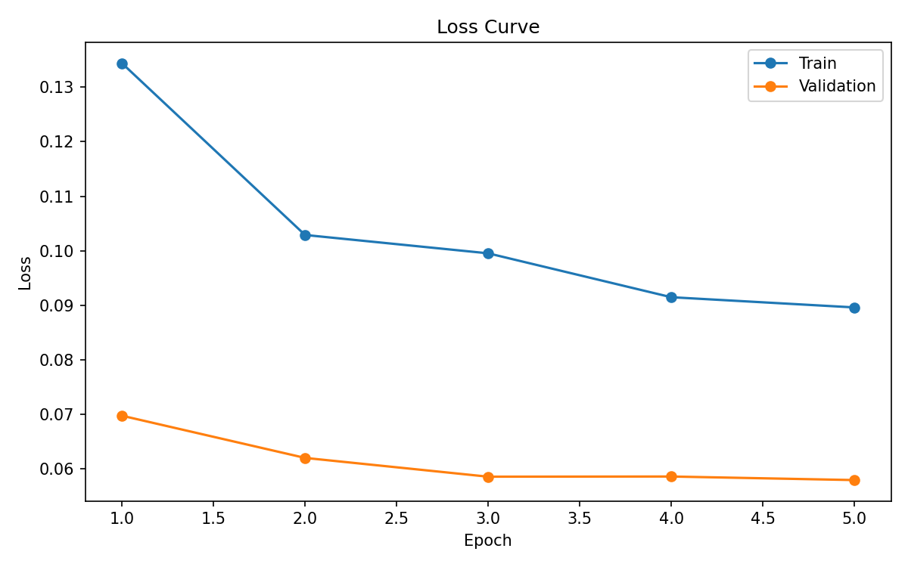
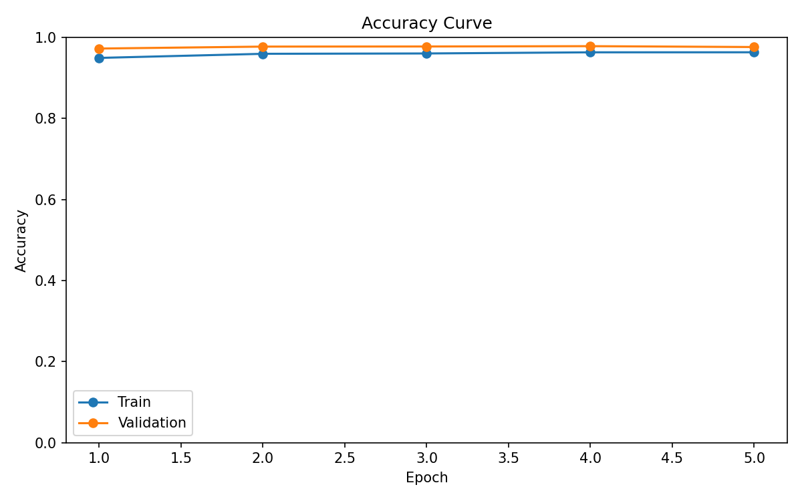
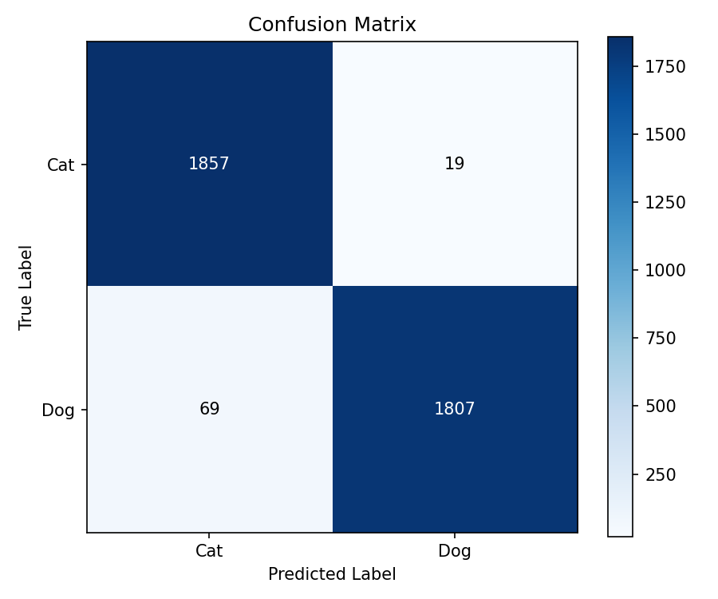
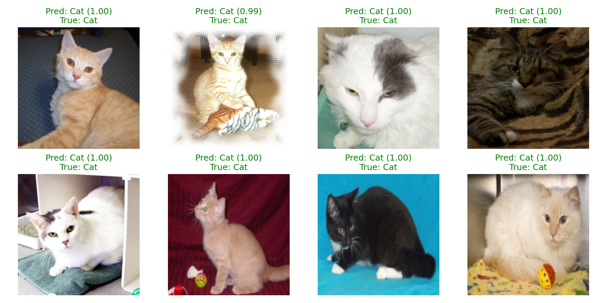

# Transfer Learning Image Classification using ResNet18

## Project Overview

This project implements a complete Transfer Learning pipeline for binary image classification (Cats vs Dogs) using a pre-trained ResNet18 model from ImageNet.

The project demonstrates the full deep learning workflow, including dataset preparation, preprocessing, data augmentation, transfer learning, model training, evaluation, visualization, and model checkpointing.

The implementation follows a clean and modular structure using Jupyter Notebook together with reusable Python modules.

---

## Features

- Dataset splitting (Train / Validation / Test)
- Image preprocessing
- Data augmentation
- Transfer Learning using ResNet18
- Frozen feature extractor
- Custom classifier head
- Training with validation monitoring
- Best model checkpoint saving
- Training history visualization
- Confusion Matrix generation
- Classification Report
- Custom image prediction
- Sample prediction visualization

---

# Project Structure

```text
transfer-learning-image-classification/
│
├── .gitignore
├── README.md
├── requirements.txt
│
├── notebooks/
│   └── transfer_learning_evaluation.ipynb
│
├── src/
│   ├── dataset.py
│   ├── model.py
│   ├── train.py
│   ├── evaluate.py
│   └── utils.py
│
├── dataset/
│   ├── raw/
│   └── processed/
│
└── results/
    ├── best_model.pth
    └── plots/
        ├── accuracy_curve.png
        ├── loss_curve.png
        ├── confusion_matrix.png
        └── sample_predictions.png
```

---

# Dataset

Dataset: Microsoft Cats vs Dogs (PetImages)

Classes

- Cat
- Dog

Dataset Split

| Split      | Ratio |
| ---------- | ----: |
| Train      |   70% |
| Validation |   15% |
| Test       |   15% |

Image Size

```
224 × 224
```

---

## Dataset Download

The dataset is not included in this repository because of its size.

Download the Microsoft Cats vs Dogs dataset from:

https://www.microsoft.com/en-us/download/details.aspx?id=54765

Extract the dataset into:

dataset/raw/PetImages/

# Data Preprocessing

The following preprocessing pipeline is applied:

- Resize images to 224×224
- Random Horizontal Flip
- Random Rotation
- Color Jitter
- Tensor Conversion
- ImageNet Normalization

---

# Model Architecture

Pre-trained Backbone

- ResNet18
- ImageNet Pretrained Weights

Transfer Learning Strategy

- Freeze all convolutional layers
- Replace the final Fully Connected layer
- Train only the classifier head

---

# Training Configuration

Loss Function

- CrossEntropyLoss

Optimizer

- Adam

Epochs

- 5

Batch Size

- 32

---

# Results

| Metric              | Value      |
| ------------------- | ---------- |
| Train Accuracy      | 97.39%     |
| Validation Accuracy | 97.84%     |
| Test Accuracy       | **97.65%** |

---

# Visualizations

## Loss Curve



---

## Accuracy Curve



---

## Confusion Matrix



---

## Sample Predictions



---

# Setup Instructions

## 1. Clone Repository

```bash
git clone https://github.com/Keroayman34/transfer-learning-image-classification.git
```

---

## 2. Enter Project

```bash
cd transfer-learning-image-classification
```

---

## 3. Create Virtual Environment

```bash
python -m venv .venv
```

Linux / macOS

```bash
source .venv/bin/activate
```

Windows

```bash
.venv\Scripts\activate
```

---

## 4. Install Dependencies

```bash
pip install -r requirements.txt
```

---

## 5. Launch Jupyter Notebook

```bash
jupyter notebook
```

Open

```
notebooks/transfer_learning_evaluation.ipynb
```

Run all notebook cells.

---

# Repository Contents

The notebook demonstrates the complete pipeline:

- Dataset exploration
- Dataset splitting
- Data augmentation
- Transfer Learning
- Training
- Evaluation
- Confusion Matrix
- Prediction on custom images
- Saving the best model

---

# Technologies

- Python
- PyTorch
- Torchvision
- NumPy
- Matplotlib
- Pillow
- Scikit-learn
- Jupyter Notebook

---

# Future Improvements

- Fine-tuning the upper ResNet layers
- Hyperparameter optimization
- Learning Rate Scheduler
- Early Stopping
- Support for additional datasets

---

# Author

Kerollos Ayman

Open Source Track — Information Technology Institute (ITI)
